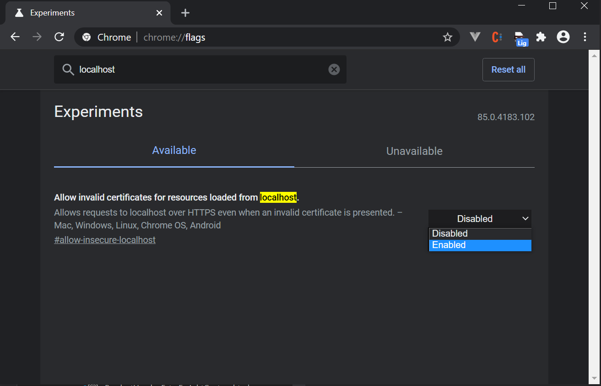

# @epinova/webpack

Default Webpack configuration for Epinova Webpack projects

## Usage

`webpack.config.js`

```javascript
const epinovaWebpackConfig = require("@epinova/webpack");

const config = epinovaWebpackConfig({}, (config) => {
    config.entry = "./Scripts/global/index.js";

    return config;
});

module.exports = config;
```

## Advanced

```javascript
const epinovaWebpackConfig = require('@epinova/webpack');

const config = epinovaWebpackConfig({
    path: 'public',
    devServerPort: 9000
}, (config, env, argv) => {
    config.entry = './Scripts/global/index.js';

    if(env === 'development') {
        ...
    }

    return config;
});

module.exports = config;
```

# HTTPS

Using webpack-dev-server with https is now possible, to activate https you need to pass `https: true` to the epinova config.

```javascript
const config = epinovaWebpackConfig({ https: true }, config => {
    ...

    return config;
});
```

## Browser issues

### Chrome

To be able to use webpack-dev-server and https in Chrome you will have to input `chrome://flags/` in the url field and on that page search for localhost and find the experiment called "Allow invalid certificates for resources loaded from localhost." and set that experiment to Enable.

This will prevent the `Failed to load resource: net::ERR_CERT_AUTHORITY_INVALID` errors that you may see in the Chrome Console and will also allow you to not have to accept/sign webpack-dev-servers self signed certificate.



### Firefox

For Firefox you need to open the console and check for lines such as `Error loading script "https://127.0.0.1/dist/global.js"` and click the link to the JavaScript file. Firefox will then show you an alert page which says the certificate is not safe, you can then click "Advanced" and accept the certificate anyways.

# Customization/Examples

## GlobbedEntriesPlugin

`npm i --save globbed-webpack-entries-plugin`

```javascript
const epinovaWebpackConfig = require("@epinova/webpack");
const GlobbedEntriesPlugin = require("globbed-webpack-entries-plugin");

const config = epinovaWebpackConfig({}, (config) => {
    config.entry = GlobbedEntriesPlugin.entries({
        global: ["./Scripts/global/**/*.js", "./Styles/global/**/*.scss"],
    });

    config.plugins.push(new GlobbedEntriesPlugin());

    return config;
});

module.exports = config;
```

## Vue

`npm i --save vue vue-loader vue-template-compiler`

```javascript
const epinovaWebpackConfig = require('@epinova/webpack');
const VueLoaderPlugin = require('vue-loader/lib/plugin')

const config = epinovaWebpackConfig({}, config => {
    ...

    config.module.rules.push({
        test: /\.vue$/,
        loader: 'vue-loader'
    });

    config.plugins.push(new VueLoaderPlugin());

    return config;
});

module.exports = config;
```

## Browserstack

[Browserstack does not like localhost url's](https://www.browserstack.com/question/759) so it is possible to start this config with a `--browserstack` argument. Example package.json script:

```javascript
{
    "test:browserstack": "webpack-dev-server --mode development --hot --hot-only --browserstack=http://bs-local.com",
}
```
