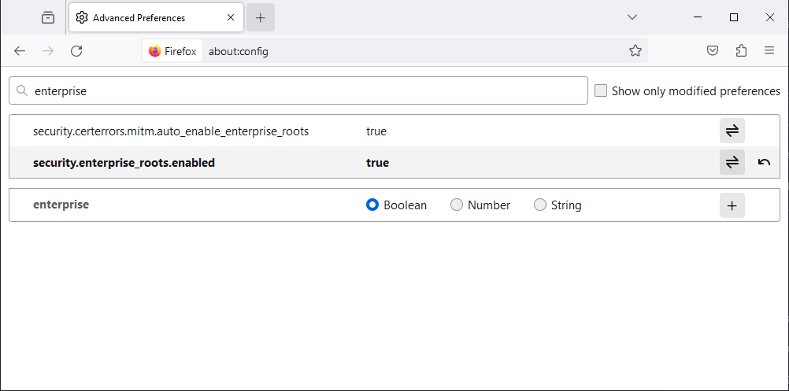

# @epinova/webpack

Default Webpack configuration for Epinova Webpack projects

# Table of Contents

1. [Release Notes](#release-notes)
1. [Usage](#usage)
1. [HTTPS](#https)
1. [Certificate](#certificate)
1. [Examples](#examples)
1. [Upgrade](#upgrade)

# Release Notes

## 1.7.1

-   Fix assets in manfiest JSON output not including public path.

## 1.7.0

-   Add JSDoc types and TypeScript checking to all configs
-   HTTPS is now default for webpack-dev-server, see the [HTTPS](#https) section on how to switch to HTTP
-   Add alert if using webpack's self signed certificate
-   Add `addCertificate()` helper to assist with adding a custom certificate
-   Readd support for "assets" section in manifest output (eg. sprite.svg from SVGSpritePlugin)

## 1.6.0

-   Webpack 5
-   Support for Node 17+

## 1.4.4

-   Fixes issue with assets missing in manifest.json

## 1.4.3

-   Added support for .tsx files in base configuration (React support)
-   Added `addVue()` method to server configuration to simplify Vue SSR configuration.

# Usage

`webpack.config.js`

```javascript
const epinovaWebpackConfig = require('@epinova/webpack');

const config = epinovaWebpackConfig({}, (config) => {
    config.entry = './Scripts/global/index.js';

    return config;
});

module.exports = config;
```

## Advanced

```javascript
const epinovaWebpackConfig = require('@epinova/webpack');

const config = epinovaWebpackConfig({
    path: 'public',
    devServerPort: 9000
}, (config, env, argv) => {
    config.entry = './Scripts/global/index.js';

    if(argv.mode === 'development') {
        ...
    }

    return config;
});

module.exports = config;
```

## TypeScript

```javascript
const path = require('path');

const epinovaWebpackConfig = require('@epinova/webpack');
const addTypeScript = require('@epinova/webpack/typescript');

module.exports = epinovaWebpackConfig(
    { path: 'wwwroot/dist', publicPath: '/dist/', https: true },
    (config, env, argv) => {
        config.name = 'Client';

        config.entry = './Scripts/global/index.js';

        addTypeScript(config, {
            configFile: path.resolve(__dirname, 'tsconfig.json'),
        });

        return config;
    }
);
```

## Dynamic Bundling

This will automatically add all files that ends with `.bundle.json` as entries to the webpack config so that you don't have to manually update entries for each new bundle. The second argument to the `addDynamicBundles` will define which folders to scan for these bundle json files.

```javascript
const path = require('path');

const epinovaWebpackConfig = require('@epinova/webpack');
const addDynamicBundles = require('@epinova/webpack/dynamic-bundles');

module.exports = epinovaWebpackConfig(
    { path: 'wwwroot/dist', publicPath: '/dist/', https: true },
    (config, env, argv) => {
        config.name = 'Client';

        config.entry = './Scripts/global/index.js';

        addDynamicBundles(config, [
            path.resolve(__dirname, 'Features'),
            path.resolve(__dirname, 'UI'),
        ]);

        return config;
    }
);
```

# HTTPS

From version 1.7.0 the config now uses https as default, so if your project requires you to run webpack in HTTP mode you have to set the https configuration to false explicitly.

```javascript
const config = epinovaWebpackConfig({ https: false }, config => {
    ...

    return config;
});
```

# Certificate

The self-signed certificate that webpack-dev-server generates will most likely cause alot of issues during development. We **strongly** recommend that you provide a certificate to the configuration.

This can be achieved by using the `addCertificate()` helper

```javascript
const path = require("path");

const epinovaWebpackConfig = require("@epinova/webpack");
const addCertificate = require("@epinova/webpack/certificate");

const config = epinovaWebpackConfig({ path: "wwwroot/dist" }, config => {
    ...

    addCertificate(config, path.join(__dirname, "webpack-dev-server.pfx"), "devcert-passphrase");

    return config;
});
```

If you don't provide a certificate you will get a warning, if you are fine with using the fallback certificate provided by webpack-dev-server you can disable this warning by adding `suppressCertificateWarning: true` to your options.

```javascript
const config = epinovaWebpackConfig({ ..., suppressCertificateWarning: true }, config => {
    ...

    return config;
});

```

## Using a .NET developer certificate

The preferred solution is to export the certificate that .NET uses when running .NET sites. To export the certificate for usage with webpack go to the folder with your webpack config file in your terminal of choice and run the following

`dotnet dev-certs https -ep ./webpack-dev-server.pfx -p devcert-passphrase --trust`

This will export the certificate to a pfx file called `webpack-dev-server.pfx` with the password `devcert-passphrase` to your current folder and also make sure it is trusted, make sure you use the filename and passphrase defined in the `addCertificate()` parameters when exporting your certificate.

## Browser issues

### Firefox

In Firefox you need to change a configuration that trusts your developer certificates. This is done by opening Settings in Firefox and then navigating to "about:config" i the URL field and clicking "Accept the Risk and Continue"

In the search bar for the preferences type "enterprise" and change the value for `security.enterprise_roots.enabled` to **true**



## Error: mac verify failure

If you get this error when running webpack the issue is most likely that the passphrase for your certificate is invalid, so make sure you export it with the passphrase defined as the 3rd parameter for `addCertificate()` in your project.

# Examples

## GlobbedEntriesPlugin

`npm i --save globbed-webpack-entries-plugin`

```javascript
const epinovaWebpackConfig = require('@epinova/webpack');
const GlobbedEntriesPlugin = require('globbed-webpack-entries-plugin');

const config = epinovaWebpackConfig({}, (config) => {
    config.entry = GlobbedEntriesPlugin.entries({
        global: ['./Scripts/global/**/*.js', './Styles/global/**/*.scss'],
    });

    config.plugins.push(new GlobbedEntriesPlugin());

    return config;
});

module.exports = config;
```

## Vue

`npm i --save vue vue-loader vue-template-compiler`

```javascript
const epinovaWebpackConfig = require('@epinova/webpack');

const config = epinovaWebpackConfig({}, config => {
    ...

    config.module.rules.push({
        test: /\.vue$/,
        loader: 'vue-loader'
    });

    config.plugins.push(new VueLoaderPlugin());

    return config;
});

module.exports = config;
```

## Browserstack

[Browserstack does not like localhost url's](https://www.browserstack.com/question/759) so it is possible to start this config with a `--env BROWSERSTACK` argument.

Example package.json script:

```json
{
    "test:browserstack": "webpack serve --mode development --config webpack.config.js --env BROWSERSTACK"
}
```

# Upgrade

## [Upgrade to v1.6](MIGRATION_1.6.md)

## Upgrade from v1.3

In v1.4 the default values for `optimization.splitChunks.chunks` & `optimization.runtimeChunk` has been updated to work better with async modules, if these new settings don't work for your project you can change them back to how they were in v1.3

```javascript
const epinovaWebpackConfig = require('@epinova/webpack');

const config = epinovaWebpackConfig({}, (config) => {
    ...
    config.optimization.splitChunks.chunks = 'initial';
    config.optimization.runtimeChunk = false;
    ...

    return config;
});

module.exports = config;
```

## Upgrade from v1.1

### Update Epinova.Webpack nuget

This update changes the format of the `manifest.json` file that the [Epinova.Webpack](https://dev.azure.com/epinova/Epinova%20-%20Modules/_git/Epinova.Webpack) nuget reads to output correct link and script tags to your CSS and script files.

This nuget requires update and has also been split into two new nugets, one for .NET 4 and one for .NET 5. The [README](https://dev.azure.com/epinova/Epinova%20-%20Modules/_git/Epinova.Webpack?anchor=epinova.webpack) file in the repository will guide you to the correct version to use.

### Node version 12+ is now required

It is worth noting that @epinova/webpack v1.3.0+ requires Node 12 or newer so you will need to update your system and potentially any build agents to use Node 12+. (It is recommended to switch to the current LTS version, which is currently Node 14)

### Babel

You will most likely get errors like `Module not found: Error: Can't resolve 'core-js/modules/es6.array.filter.js'` when updating from older versions, to fix this we need to update the babel configuration.

In the package.json file change this section

```json
"babel": {
    "presets": [
        [
            "@babel/preset-env",
            {
                "useBuiltIns": "usage"
            }
        ]
    ]
}
```

to

```json
"babel": {
    "presets": ["@babel/preset-env"]
},
```
